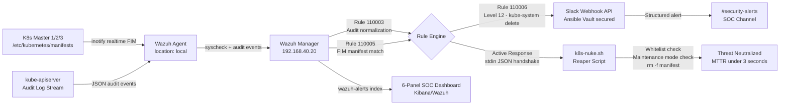

# security-sentinel


**Production-grade Kubernetes Active Response Sentinel. Automated Incident Response (AIR) engine integrating Wazuh SIEM, custom XML rule tiers, Bash-based active response, and a 6-panel SOC dashboard for real-time cluster security operations.**

> MTTD under 5 seconds. MTTR under 3 seconds. Race-condition-aware OS syscall detection. Operated to production standards. Everything here is verified operational.

---

## Overview

This repository is the source of truth for the **Kubernetes Control Plane Sentinel** — a fully deployed SOAR pipeline defending a 7-node Kubernetes HA cluster against Static Pod persistence attacks and destructive API activity.

The system operates across three phases: an **Automated Response Engine** that detects and neutralizes unauthorized control plane manifests before the Kubelet can initialize them, a **Security Operations Center** providing real-time visibility into cluster API activity, actor identity, and mitigation events through a 6-panel Wazuh/Kibana dashboard, and a **Host Hardening** layer providing automated SSH brute-force blocking at the network layer.

**Design Philosophy:** This project prioritizes Safe Automation. By implementing a maintenance kill-switch and control-plane whitelists, the Sentinel provides high-security remediation without introducing operational instability or self-DoS risks common in naive automation scripts.

---

## Full Pipeline Architecture



---

## Phase 1 — Automated Response Engine

### The Threat: Static Pod Persistence

A malicious YAML file dropped into `/etc/kubernetes/manifests` bypasses the Kubernetes API server, RBAC, and audit logging entirely. The Kubelet picks it up directly, giving an attacker node-level persistence that survives `kubectl delete`. The Sentinel operates at the OS syscall layer via `inotify` — consistently outperforming the Kubelet's reconciliation loop to delete malicious manifests before they can initialize.

### Rule Tier — Detection Logic

**Rule 110005** — FIM Trigger (`wazuh/rules/local_rules.xml`):
```xml
<group name="kubernetes_security,">
  <rule id="110005" level="12">
    <if_sid>550, 554</if_sid>
    <regex>/etc/kubernetes/manifests/</regex>
    <description>K8S CLUSTER ATTACK: Manifest Tampering Detected</description>
  </rule>
</group>
```

### Active Response — k8s-nuke.sh (v2.0.0)

**Engineering decisions:**

- **stdin JSON handshake** — Wazuh delivers the full alert as a JSON object via stdin. PCRE regex (`grep -oP`) extracts the exact `path` field for surgical file targeting
- **Intelligent whitelisting** — regex guard prevents deletion of core control plane components regardless of rule trigger. Protected components:

```bash
WHITELIST="kube-apiserver|kube-controller-manager|kube-scheduler|etcd"
# If FILE_PATH matches any of the above → log and exit, no deletion
```
- **Maintenance mode kill switch** — presence of `/tmp/SENTINEL_OFF` halts all active response execution, enabling authorized cluster upgrades without triggering the reaper
- **Zero-trust path guard** — all operations validated against `SAFE_DIR=/etc/kubernetes/manifests` before execution
- **Forensic audit trail** — every event timestamped and logged to `/var/ossec/logs/active-responses.log` with full raw JSON input

### Active Response Binding (`ossec.conf`)
```xml
<command>
  <name>k8s-nuke</name>
  <executable>k8s-nuke.sh</executable>
  <expect>filename</expect>
  <timeout_allowed>no</timeout_allowed>
</command>

<active-response>
  <command>k8s-nuke</command>
  <location>local</location>
  <rules_id>110005</rules_id>
</active-response>
```

`<location>local</location>` routes responses dynamically to the triggering agent — no hardcoded agent IDs. Scales horizontally from 3 nodes to 300 without configuration changes.

### Verified Cluster-Wide Deployment

| Node | IP | k8s-nuke.sh | Active Response | Whitelist | Maintenance Mode |
|------|----|-------------|----------------|-----------|-----------------|
| k8s-master-1 | 192.168.20.10 | Deployed | ✅ Verified | ✅ Active | /tmp/SENTINEL_OFF |
| k8s-master-2 | 192.168.20.11 | Deployed | ✅ Verified | ✅ Active | /tmp/SENTINEL_OFF |
| k8s-master-3 | 192.168.20.12 | Deployed | ✅ Verified | ✅ Active | /tmp/SENTINEL_OFF |

---

## Phase 2 — Security Operations Center

### Rule Tier — Audit & Behavioral Detection

**Rule 110003** — K8s Audit Normalization:
Ingests raw Kubernetes JSON audit log stream from kube-apiserver. Maps `data.verb`, `data.objectRef.namespace`, `data.objectRef.resource`, and `data.sourceIPs` to Wazuh's internal field architecture for coherent querying and dashboard visualization.

**Rule 110006** — Level 12 Behavioral Alert:
Triggers on destructive API actions (`delete`, `patch`) within the `kube-system` namespace. Level 12 classification routes directly to Slack via webhook integration — instant SOC notification for high-risk cluster activity.

### 6-Panel SOC Dashboard (Wazuh/Kibana)

Built on the `wazuh-alerts-*` index with KQL-filtered visualizations:

| Panel | Type | Purpose |
|-------|------|---------|
| Namespace Distribution | Pie chart | Blast-radius visualization — resource allocation by namespace |
| Urgency Metric | Metric counter | Real-time count of Level 12+ security events |
| Identity Audit | Data table | `user.username` tracking for every API call — actor attribution |
| API Verb Breakdown | Horizontal bar chart | `get` vs. `delete` volume ratio — behavioral baselining |
| Sentinel Audit Trail | Filtered table | Dedicated log of every automated mitigation event from k8s-nuke.sh |
| High-Risk Timeline | Date histogram (KQL-filtered) | Temporal spikes in destructive cluster activity |

---

## Phase 3 — Host Hardening (IPS)

**Rule 110010** — SSH Brute Force Mitigation (Level 12):
Detects invalid SSH user attempts across all monitored hosts. Includes `ignore_time="60"` throttle to prevent alert fatigue while triggering an automated IP block via Wazuh Active Response at the network layer. Verified during build — blocked Windows PC (192.168.10.100) on first failed attempt.

```xml
<rule id="110010" level="12" ignore_time="60">
  <if_sid>5710</if_sid>
  <description>FORCE BLOCK: Invalid SSH User Detected</description>
  <group>authentication_failed,pci_dss_10.2.4,pci_dss_10.2.5</group>
</rule>
```

---

## FIM Centralization — agent.conf

All FIM configuration is centralized on the Wazuh Manager and pushed to all 10 agents via `/var/ossec/etc/shared/default/agent.conf`. No per-agent syscheck configuration required.

**Monitored paths (pushed cluster-wide):**

| Path | Mode | Purpose |
|------|------|---------|
| `/etc/kubernetes/manifests` | realtime, check_all | Control plane manifest tampering |
| `/var/ossec/etc/rules` | realtime, check_all | Wazuh rule integrity |
| `/var/ossec/active-response/bin` | realtime, check_all | Active response script integrity |
| `/etc/cron.d` | realtime, check_all | Cron persistence detection |
| `/usr/bin/kubectl` | check_all | Binary integrity |
| `/etc/passwd`, `/etc/shadow`, `/etc/hosts` | check_all | Credential and host file tampering |

This approach mirrors enterprise SIEM deployments where FIM policy is managed centrally and agents are policy consumers — no SSH required to update monitoring scope across a fleet.

---

## Defense-in-Depth Architecture

| Layer | Control | Protects Against |
|-------|---------|-----------------|
| API Server | RBAC + Admission Controllers | Unauthorized API requests |
| Host Filesystem | Wazuh FIM + k8s-nuke.sh | Static pod persistence bypassing API |
| Host Network | Rule 110010 + Active Response | SSH brute force and unauthorized access |
| Behavioral | Rule 110006 + Slack | Destructive API activity in kube-system |
| Audit | Rule 110003 + SOC Dashboard | Actor attribution and forensic trail |

The Sentinel specifically addresses the gap that Admission Controllers (OPA/Kyverno) cannot cover — attacks that bypass the API server entirely by writing directly to the host filesystem.

---

## Detection to Remediation Timeline

| Stage | Component | Latency |
|-------|-----------|---------|
| File change detected | Wazuh FIM (inotify) | < 1s |
| Rule 110005 matched | Wazuh Manager | < 1s |
| Slack alert delivered | Webhook API | < 3s MTTD |
| Active response dispatched | Manager → local agent | < 1s |
| Whitelist + maintenance check | k8s-nuke.sh | Milliseconds |
| Unauthorized manifest deleted | rm -f | < 3s MTTR |

---

## Secrets Management

All credentials managed through **Ansible Vault** — production-grade secret management at rest.

- Slack webhook URL lives exclusively in `ansible/vars/secrets.yml`, encrypted with `ansible-vault encrypt`
- Vault password stored locally only at `~/.ansible_vault_pass` (`chmod 600`) — never committed
- `no_log: true` set on every Ansible task referencing sensitive variables — webhook URL never surfaces in playbook output even under `-v` verbose mode
- Pre-push secret scan verified clean: `Get-ChildItem -Recurse -File | Select-String -Pattern "hooks.slack.com"` — zero real credentials in version control
- `.gitignore` explicitly blocks `*.vault_pass`, `secrets.yml.unencrypted`, and all `.env` files

---

## Repository Structure

```
security-sentinel/
├── README.md
├── .gitignore
├── ansible/
│   ├── vars/
│   │   └── secrets.yml              # Ansible Vault - slack_webhook_url (encrypted)
│   └── playbooks/
│       └── wazuh_self_healing.yml   # RFC 6724 fix + Slack alert on remediation
└── wazuh/
    ├── rules/
    │   └── local_rules.xml          # Rules 110001, 110003, 110005, 110006, 110007, 110010
    └── active-response/
        └── k8s-nuke.sh              # Reaper - whitelist, maintenance mode, PCRE parsing
```

---

## Environment

| Component | Detail |
|-----------|--------|
| Wazuh Version | 4.14.3 |
| Monitored Nodes | 3 K8s control planes + 4 workers + 3 Proxmox hosts |
| Agent Count | 10 |
| Cluster | 7-node K8s HA (kubeadm), etcd quorum |
| Alert Destination | Slack #security-alerts |
| Compliance | PCI DSS 11.5, GPG13 4.11, MITRE ATT&CK T1485, NIST 800-53 |
| MTTD | < 5 seconds |
| MTTR | < 3 seconds |

---

## Roadmap

- [x] Centralize FIM config via `agent.conf` on Wazuh Manager
- [x] K8s NetworkPolicy enforcement layer
- [ ] Hash-based whitelisting in k8s-nuke.sh for authorized manifest validation
- [ ] OPA/Gatekeeper policy-as-code via ArgoCD
- [ ] K8s audit logging routed into Wazuh SIEM pipeline

---

## Related

- [`homelab`](https://github.com/brypreez/homelab) — Full infrastructure repository (Proxmox, Kubernetes, Terraform, Ansible, Observability)

---

*Operated to production standards. Everything here is verified operational.*
