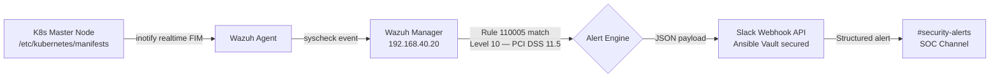

# security-sentinel

**Enterprise-grade security orchestration for Kubernetes. Integrates Wazuh SIEM, custom XML FIM rules, and Ansible Vault for real-time monitoring.**

> MTTD under 5 seconds from file change to SOC alert. Operated to production standards. Everything here is verified operational.

---

## Overview

This repository contains the detection logic, automation playbooks, and infrastructure-as-code for the **Kubernetes Control Plane Sentinel** — a real-time security orchestration pipeline designed to detect and alert on control plane tampering in a 5-node Kubernetes HA environment.

The pipeline monitors `/etc/kubernetes/manifests` across 3 control plane nodes using Wazuh FIM, matches events against a custom XML detection rule (Rule 110005, Level 10), and delivers structured JSON alerts to a SOC Slack channel via Webhook API — with credentials managed through Ansible Vault.

---

## Security Pipeline



---

## Detection Logic

**Monitored Path:** `/etc/kubernetes/manifests` (realtime, check_all) — all 3 control plane nodes

**Custom Rule 110005** (`wazuh/rules/local_rules.xml`):

```xml
<group name="syscheck,k8s_security,">
  <rule id="110005" level="10">
    <if_sid>550</if_sid>
    <field name="file">/etc/kubernetes/manifests</field>
    <description>CRITICAL: K8s Manifest Tampering Detected on $(agent.name)</description>
    <group>syscheck,k8s_security,pci_dss_11.5,gpg13_4.11,</group>
  </rule>
</group>
```

**Compliance Tags:** PCI DSS 11.5 · GPG13 4.11

**Threat Coverage:**
- Supply chain attacks via control plane manifest injection
- Privilege escalation through kube-apiserver flag modification
- Audit log suppression via manifest tampering
- Unauthorized admission controller insertion

---

## Repository Structure

```
security-sentinel/
├── README.md
├── .gitignore
├── ansible/
│   └── playbooks/
│       └── wazuh_self_healing.yml     # Idempotent config enforcement across 8-node fleet
└── wazuh/
    └── rules/
        └── local_rules.xml            # Custom Rule 110005 — K8s manifest tampering detection
```

---

## Secrets Management

Slack webhook URL and all sensitive credentials are stored in **Ansible Vault** — never in plaintext, never committed to version control. The `.gitignore` in this repository explicitly blocks all `.tfvars`, vault files, and state files.

---

## Environment

| Component | Detail |
|-----------|--------|
| Wazuh Version | 4.14.3 |
| Monitored Nodes | 3 K8s control planes + 2 workers + 3 Proxmox hosts |
| Agent Count | 8 |
| Cluster | 5-node K8s HA (kubeadm), etcd quorum |
| Alert Destination | Slack `#security-alerts` |
| Compliance | PCI DSS 11.5, GPG13 4.11 |

---

## Related

- [`homelab`](https://github.com/brypreez/homelab) — Full infrastructure repository (Proxmox, Kubernetes, Terraform, Ansible, Observability)

---

*Operated to production standards. Everything here is verified operational.*
