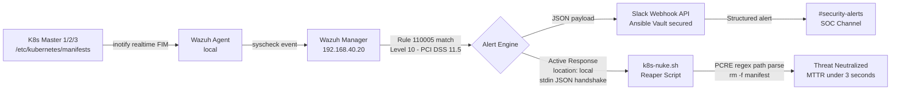

# security-sentinel

**Enterprise-grade Security Orchestration, Automation, and Response (SOAR) for Kubernetes. Integrates Wazuh SIEM, custom XML FIM rules, Ansible Vault, and an automated active response reaper for real-time detection and remediation.**

> MTTD under 5 seconds. MTTR under 3 seconds. Cluster-wide orchestration across all control plane nodes. Operated to production standards. Everything here is verified operational.

---

## Overview

This repository contains the detection logic, automation playbooks, active response scripts, and infrastructure-as-code for the **Kubernetes Control Plane Sentinel** — a real-time SOAR pipeline defending a 5-node Kubernetes HA cluster against Static Pod persistence attacks.

The pipeline monitors `/etc/kubernetes/manifests` across all 3 control plane nodes simultaneously, matches FIM events against a custom detection rule (Rule 110005, Level 10), delivers structured JSON alerts to a SOC Slack channel, and executes an automated reaper script that neutralizes unauthorized manifests before the Kubelet can pull the image — with no hardcoded agent IDs and no manual intervention required.

---

## Full Pipeline Architecture



---

## Problem Statement

Kubernetes Static Pods are a high-level attack vector for persistent root access. A malicious YAML file dropped into `/etc/kubernetes/manifests` is picked up directly by the Kubelet — bypassing the API server, RBAC, and audit logging entirely. Once the static pod is running, the attacker has node-level persistence that survives `kubectl delete`.

The default Wazuh configuration does not monitor this directory. The default security posture has no automated response to this vector. Detection alone is insufficient.

---

## Solution: Automated Delete-on-Detection

### Detection — Rule 110005 (`wazuh/rules/local_rules.xml`)

```xml
<group name="syscheck,k8s_security,">
  <rule id="110005" level="10">
    <if_sid>550</if_sid>
    <field name="file">/etc/kubernetes/manifests</field>
    <description>CRITICAL: K8s Manifest Tampering Detected on $(agent.name) - file: $(file)</description>
    <group>syscheck,k8s_security,pci_dss_11.5,gpg13_4.11,</group>
  </rule>
</group>
```

### Active Response Binding (`ossec.conf`)

```xml
<command>
  <name>k8s-nuke</name>
  <executable>k8s-nuke.sh</executable>
  <expect>filename</expect>
  <timeout_allowed>no</timeout_allowed>
</command>

<active-response>
  <command>k8s-nuke</command>
  <location>local</location>
  <rules_id>110005</rules_id>
</active-response>
```

`<location>local</location>` means the Manager dynamically routes the response to whichever agent triggered the alert — no hardcoded agent IDs. This configuration scales horizontally: 3 master nodes today, 300 tomorrow, without changing a single line of XML.

### Automated Reaper — k8s-nuke.sh (`wazuh/active-response/k8s-nuke.sh`)

**Engineering decisions:**

- **stdin JSON handshake** — Wazuh delivers the full alert JSON via stdin. The script uses PCRE regex (`grep -oP`) to extract the exact `path` field from the payload, identifying the unauthorized manifest with surgical precision
- **Zero-trust path guard** — before any `rm` executes, the path is validated against `SAFE_DIR=/etc/kubernetes/manifests`. Prevents command injection or collateral damage if rule misconfiguration occurs
- **Forensic audit trail** — every execution event (detection, removal, safety block, or miss) is timestamped and written to `/var/ossec/logs/active-responses.log` with the full raw JSON input

```bash
SAFE_DIR="/etc/kubernetes/manifests"
FILE_PATH=$(echo "$INPUT" | grep -oP '(?<="path":")[^"]*')

if [[ "$FILE_PATH" == "$SAFE_DIR"* ]]; then
    rm -f "$FILE_PATH"
    echo "$(date) - SUCCESS: $FILE_PATH removed." >> "$LOG_FILE"
else
    echo "$(date) - SAFETY ALERT: Path outside safe dir blocked." >> "$LOG_FILE"
fi
```

---

## Verified Cluster-Wide Deployment

Active response confirmed operational on all three control plane nodes:

| Node | IP | Status |
|------|----|--------|
| k8s-master-1 | 192.168.20.10 | Active response verified |
| k8s-master-2 | 192.168.20.11 | Active response verified |
| k8s-master-3 | 192.168.20.12 | Active response verified |

**Validation test:**
```bash
sudo touch /etc/kubernetes/manifests/cluster-wide-test.yaml
# File removed by k8s-nuke.sh within 3 seconds
```

---

## Detection to Remediation Timeline

| Stage | Component | Latency |
|-------|-----------|---------|
| File change detected | Wazuh FIM (inotify realtime) | < 1s |
| Rule 110005 matched | Wazuh Manager analysis engine | < 1s |
| Slack alert delivered | Webhook API (Ansible Vault secured) | < 3s total MTTD |
| Active response dispatched | Manager → local agent | < 1s |
| Unauthorized manifest deleted | k8s-nuke.sh | < 3s total MTTR |

---

## Key Engineering Wins

**Horizontal scalability** — `<location>local</location>` routes responses dynamically to the triggering agent. No agent IDs hardcoded. Scales from 3 nodes to 300 without configuration changes.

**XML dependency ordering** — Wazuh requires `<command>` to be declared before `<active-response>` in `ossec.conf`. Incorrect ordering produces a silent parse failure. Validated with `wazuh-analysisd -t` before every restart.

**JSON payload parsing** — Wazuh passes alert data as a JSON object via stdin, not as shell arguments. Extracting the `path` field required PCRE regex on raw stdin rather than positional argument handling.

**Secrets management** — Slack webhook URL stored exclusively in Ansible Vault. `no_log: true` on all playbook tasks referencing the variable. Zero secrets in version control.

---

## Secrets Management

All credentials managed through **Ansible Vault**. The `.gitignore` blocks `.tfvars`, vault files, and Terraform state. `no_log: true` set on all tasks referencing sensitive variables — webhook URL never surfaces in playbook output even under verbose logging.

---

## Repository Structure

```
security-sentinel/
├── README.md
├── .gitignore
├── ansible/
│   ├── vars/
│   │   └── secrets.yml              # Ansible Vault - slack_webhook_url (encrypted)
│   └── playbooks/
│       └── wazuh_self_healing.yml   # RFC 6724 fix + Slack alert on remediation
└── wazuh/
    ├── rules/
    │   └── local_rules.xml          # Rule 110005 - K8s manifest tampering detection
    └── active-response/
        └── k8s-nuke.sh              # Automated reaper - delete-on-detection policy
```

---

## Environment

| Component | Detail |
|-----------|--------|
| Wazuh Version | 4.14.3 |
| Monitored Nodes | 3 K8s control planes + 2 workers + 3 Proxmox hosts |
| Agent Count | 8 |
| Cluster | 5-node K8s HA (kubeadm), etcd quorum |
| Alert Destination | Slack #security-alerts |
| Compliance | PCI DSS 11.5, GPG13 4.11 |
| MTTD | < 5 seconds |
| MTTR | < 3 seconds |

---

## Roadmap

- [ ] Centralize FIM config via `agent.conf` on Wazuh Manager — manage all nodes from one file
- [ ] Whitelist logic in `k8s-nuke.sh` — hash or comment validation to protect authorized automated updates
- [ ] K8s Audit Logging → Wazuh — route kube-apiserver audit events into SIEM pipeline
- [ ] GitHub Actions — `wazuh-analysisd -t` validation on every PR touching `ossec.conf` or rules

---

## Related

- [`homelab`](https://github.com/brypreez/homelab) — Full infrastructure repository (Proxmox, Kubernetes, Terraform, Ansible, Observability)

---

*Operated to production standards. Everything here is verified operational.*
